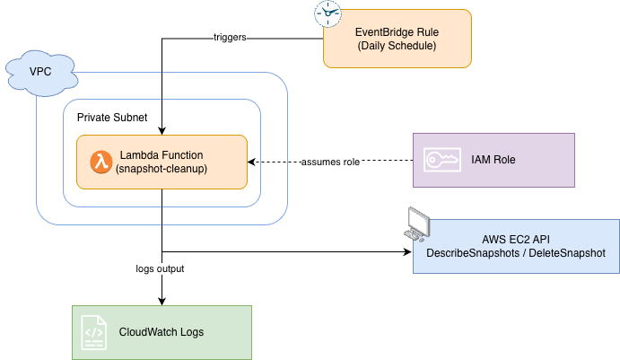
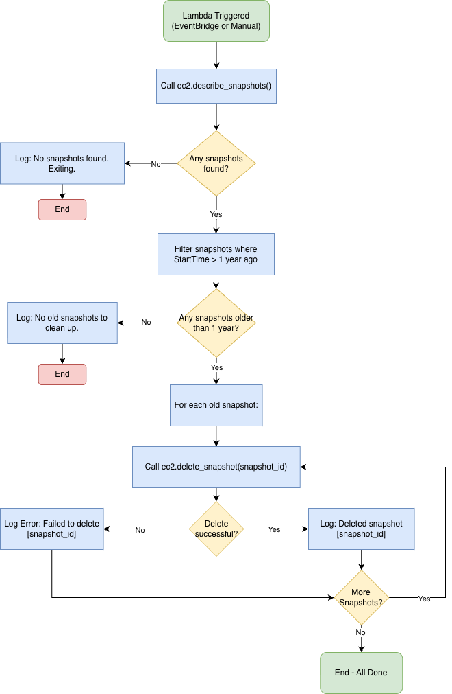

# AWS Snapshot Cleanup

A Lambda function that automatically deletes EC2 snapshots older than one year. Runs daily on a schedule, lives inside a private VPC, and fully defined with Terraform.

If you want to see my full thought process as I built this, check the [dev logs](docs/dev-logs/index.md).

---

## Architecture





---

## Why Terraform

I went with Terraform over CloudFormation for a few reasons:

- Not locked to AWS — if infra ever needs to move or expand, Terraform handles it.
- HCL is easier to read and review than CloudFormation's JSON/YAML.
- Splitting resources into separate `.tf` files (`vpc.tf`, `iam.tf`, `lambda.tf`, etc.) keeps things organized and easy to maintain.
- Most platform/DevOps teams are already using it.

---

## Prerequisites

You'll need:

- [Terraform](https://developer.hashicorp.com/terraform/install) >= 1.0
- [AWS CLI](https://docs.aws.amazon.com/cli/latest/userguide/install-cliv2.html) configured with an IAM user that has:
  - `AmazonVPCFullAccess`
  - `AWSLambda_FullAccess`
  - `IAMFullAccess`
  - `CloudWatchEventsFullAccess`
  - `AmazonEC2FullAccess`

> Don't use your root account. Create a dedicated IAM user, generate access keys, and run `aws configure`.

---

## Deploy

Terraform handles everything including zipping and uploading the Lambda code, so no manual packaging needed.

```bash
cd terraform
terraform init
terraform plan
terraform apply
```

This will create:
- VPC + private subnet
- Security group for Lambda
- IAM role with least-privilege permissions
- VPC Endpoint for EC2 — needed since Lambda is in a private subnet and can't reach the EC2 API without it
- Lambda function deployed from `lambda/handler.py`
- EventBridge rule to trigger Lambda daily at 8:00 AM UTC

After apply, Terraform outputs the key resource IDs:

```
ec2_vpc_endpoint_id        = "vpce-..."
lambda_role_arn            = "arn:aws:iam::..."
lambda_security_group_id   = "sg-..."
private_subnet_id          = "subnet-..."
vpc_id                     = "vpc-..."
```

### Re-deploying after code changes

Just run `terraform apply` again. Terraform detects code changes via `source_code_hash` and re-deploys automatically.

---

## VPC Configuration

Lambda runs inside a private subnet — no internet access by design. I wired this in `terraform/lambda.tf`:

```hcl
vpc_config {
  subnet_ids         = [aws_subnet.private.id]
  security_group_ids = [aws_security_group.lambda_security_group.id]
}
```

Since the subnet is private, Lambda can't reach public AWS endpoints directly. I added a VPC Interface Endpoint for EC2 so Lambda can call the EC2 API privately, entirely within AWS's network. The security group has an inbound rule on port 443 (`self = true`) to allow Lambda to talk to the endpoint's ENI.

---

## Configuration

| Variable | Default | Description |
|---|---|---|
| `aws_region` | `us-east-1` | AWS region to deploy into |
| `project_name` | `snapshot-cleanup` | Prefix applied to all resource names |
| `CUTOFF_DAYS` | `365` | Snapshots older than this many days get deleted |

`aws_region` and `project_name` are in `terraform/variables.tf`. `CUTOFF_DAYS` is an environment variable on the Lambda, configured in `terraform/lambda.tf`.

---

## Assumptions

- Region is `us-east-1` by default — it's the AWS default and where new services launch first. Can be changed in `variables.tf`.
- Only snapshots owned by the account are processed (`OwnerIds=["self"]`). Without this, it would pull public snapshots from across AWS and try to delete those too.
- Cutoff is 365 days. Configurable via `CUTOFF_DAYS` if needed.
- This assumes EC2 snapshots already exist in the account. The Lambda doesn't create instances or snapshots — it only cleans up old ones.

---

## Monitoring

Every action gets logged to CloudWatch Logs automatically. Log group:

```
/aws/lambda/snapshot-cleanup-lambda
```

What you'll see:
- How many snapshots older than the cutoff were found
- Each snapshot being deleted (`Deleting snapshot: snap-xxxxxxxx`)
- Any failures with the error message (`Failed to delete snapshot snap-xxxxxxxx: ...`)
- Final count of snapshots attempted when the run is done

To tail logs via CLI:

```bash
aws logs tail /aws/lambda/snapshot-cleanup-lambda --follow
```

Or: **AWS Console → CloudWatch → Log Groups → /aws/lambda/snapshot-cleanup-lambda**

---

## Tests

Tests use `pytest` + `moto` to mock AWS locally. No real AWS account needed.

```bash
pip install 'moto[ec2]' pytest
pytest tests/ -v
```

---

## Teardown

```bash
cd terraform
terraform destroy
```
